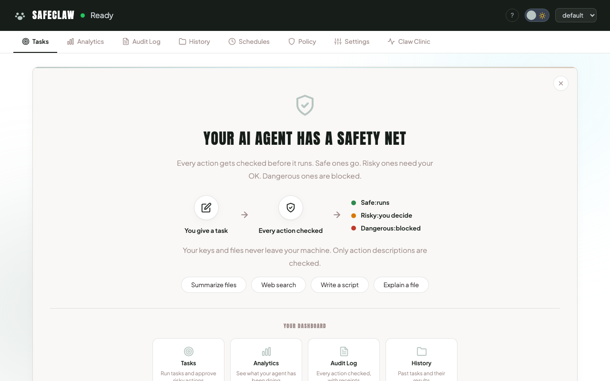

# SafeClaw

**AI agents that ask before they act.**

SafeClaw intercepts every action your AI agent tries to take (file writes, shell commands, network requests) and checks it against a safety policy before it executes. If something looks risky, you get asked first. Nothing runs without your say-so.

Works with **Claude** and **OpenAI**. Open-source client. Free tier included.



## Install

```bash
npx @authensor/safeclaw
```

Your browser opens. A wizard walks you through everything: pick your AI provider, paste your API key, and you're running.

> **Need Node.js?** Download it at [nodejs.org](https://nodejs.org/) (v20+). That's the only prerequisite.

### Other install options

**GUI (no terminal):** [Download the release](https://github.com/AUTHENSOR/SafeClaw/releases), extract, double-click the launcher.

**Clone and run:**
```bash
git clone https://github.com/AUTHENSOR/SafeClaw.git && cd SafeClaw
npm install && npm start
```

## How it works

Every tool call your AI agent makes goes through SafeClaw's gateway before it executes:

```
You give the agent a task
  → Agent decides to take an action (write a file, run a command, etc.)
  → SafeClaw intercepts it
  → Checks it against your policy: allow / deny / require approval
  → If approval needed: you get notified, agent waits for your decision
  → Action only runs after you approve
```

**What leaves your machine:** Action metadata only (e.g., `"filesystem.write /tmp/output.txt"`)
**What stays local:** Your API keys, your files, your data. Always.

## Features

- **Multi-provider:** Claude (Anthropic SDK) and OpenAI (GPT-4o, custom loop)
- **Browser dashboard:** setup wizard, task runner, approval center, analytics, policy editor, settings
- **Policy engine:** deny-by-default rules, visual editor, versioning, rollback, dry-run simulation, time-based rules
- **Audit ledger:** append-only JSONL with SHA-256 hash chain, tamper detection via `audit verify`
- **Analytics:** cost tracking, approval metrics, tool usage, MCP server breakdown, CSV/JSON export
- **Budget controls:** spending caps (daily/weekly/monthly) with warn/require_approval/block actions
- **Scheduler:** cron-based recurring tasks with quiet hours
- **Container mode:** Docker/Podman sandboxed execution with filesystem isolation
- **Mobile PWA:** installable, responsive, swipe-to-approve
- **SMS notifications:** Twilio integration for approval alerts
- **Webhooks:** Slack, Discord, and generic HTTP notifications
- **Offline cache:** cached allow decisions for Authensor downtime (fail-safe: denies never cached)
- **Workspace scoping:** project boundary detection, path restriction enforcement
- **Risk signals:** advisory badges on approvals for obfuscated execution, credential access, pipe-to-external, destructive commands, and persistence mechanisms

## Security model

- **Deny by default:** unknown actions are blocked
- **CSRF protection:** all write endpoints require `X-Requested-With: SafeClaw` header
- **ReDoS protection:** user-supplied regex patterns in policy rules validated for nested quantifiers before execution
- **Secrets redaction:** API keys stripped from SSE output before reaching the browser
- **File permissions:** all sensitive files written with mode 0o600
- **Rate limiting:** sliding window limits on all write API endpoints
- **Fail closed:** if Authensor is unreachable and no cached allow exists, actions are denied
- **Local pre-filter:** `safe.read.*` tools (Read, Glob, Grep, TodoWrite, AskUserQuestion, Skill, TaskOutput) are allowed locally without a control plane call. All other tools always go through Authensor
- **Security headers:** CSP, X-Frame-Options, X-Content-Type-Options, Referrer-Policy, X-XSS-Protection
- **Audit integrity:** SHA-256 hash chain on every audit entry, verifiable via `safeclaw audit verify`

## Default policy

| Action type | Effect | Examples |
|------------|--------|----------|
| `safe.read.*` | Allow (local pre-filter) | Read, Glob, Grep, TodoWrite, AskUserQuestion, Skill |
| `filesystem.*` | Require approval | Write/edit files |
| `code.*` | Require approval | Bash commands |
| `network.*` | Require approval | HTTP requests, web search |
| `secrets.*` | Require approval | Access secrets |
| `mcp.*` | Require approval | MCP tool calls |
| Everything else | Deny | - |

## Commands

```bash
safeclaw                          # Open the browser dashboard
safeclaw init                     # Set up a profile (default: Claude)
safeclaw init --provider openai   # Set up with OpenAI/GPT-4o
safeclaw init --demo              # Auto-provision a demo Authensor token
safeclaw init --workspace         # Initialize workspace scoping
safeclaw run "task"               # Run a task locally
safeclaw run --container "task"   # Run inside Docker/Podman
safeclaw run --dry-run "task"     # Preview config + policy simulation (no agent started)
safeclaw approvals                # List pending approvals
safeclaw approvals approve <id>   # Approve
safeclaw approvals reject <id>    # Reject
safeclaw receipts                 # View audit trail
safeclaw audit                    # View recent audit log
safeclaw audit verify             # Verify audit hash chain integrity
safeclaw history                  # View task history
safeclaw policy show|apply|help   # Manage policy
safeclaw profile list|use <name>  # Manage profiles
safeclaw health                   # Check Authensor connectivity
safeclaw doctor                   # Run 10 diagnostic checks
safeclaw config show              # Show current config
safeclaw --version                # Show version
```

### Flags

| Flag | Description |
|------|-------------|
| `--verbose, -v` | Show detailed output |
| `--provider <name>` | AI provider: `claude` (default) or `openai` |
| `--model <model>` | Model override (e.g. `gpt-4o`, `gpt-4o-mini`) |
| `--container` | Run inside Docker/Podman |
| `--workspace <path>` | Workspace directory for container mode |
| `--rebuild` | Rebuild container image before running |
| `--dry-run` | Show task config + policy simulation without running |
| `--no-open` | Start dashboard without opening browser |

## Architecture

```
src/
  cli.js          CLI entry point
  server.js       Localhost dashboard server (Node http, zero deps)
  agent.js        Agent runner with provider dispatch + secrets redaction
  openai-agent.js Custom agent loop for OpenAI/GPT (raw fetch, zero deps)
  gateway.js      PreToolUse hook → Authensor policy check + SMS + audit
  classifier.js   Tool name → action type mapping
  authensor.js    Authensor control plane API client
  container.js    Docker/Podman container runner
  notify.js       Twilio SMS notifications
  config.js       Profile, config, and .env management
  policy.js       Policy file management, versioning, simulation, ReDoS protection
  templates.js    Default policy template
  audit.js        Append-only JSONL audit ledger with SHA-256 hash chain
  session.js      Per-task session history
  workspace.js    Workspace detection and path scoping
  settings.js     Settings management with validation
  analytics.js    Cost summary, approval metrics, tool usage, MCP analytics
  cache.js        Offline decision cache (memory + disk, TTL-based)
  rate-limit.js   Sliding window rate limiter
  webhook.js      Slack/Discord/generic webhook notifications
  budget.js       Budget enforcement and cost estimation
  doctor.js       10 diagnostic checks for setup health
  scheduler.js    Cron-based recurring task scheduler with quiet hours
  validate.js     Input validation, ReDoS protection, secrets redaction
  logger.js       Structured JSON logging to stderr
ui/dashboard/     Browser dashboard (PWA, mobile-responsive, swipe approvals)
ui/               Standalone approvals UI (auto-refreshes every 5s)
policies/         Policy templates and schema
tests/            446 tests across 24 files
Dockerfile        Container image for sandboxed execution
```

## Configuration

All config is stored in `~/.safeclaw/`:

| File | Purpose |
|------|---------|
| `config.json` | Profiles, provider, control plane URL |
| `.env` | API keys (chmod 600, never sent anywhere) |
| `settings.json` | Timeouts, retention, cache, budget, webhooks |
| `policy.json` | Active policy rules |
| `audit.jsonl` | Append-only audit ledger with hash chain |
| `sessions/` | Per-task session history |
| `schedules.json` | Cron-based scheduled tasks |
| `decision-cache.json` | Offline allow cache |

## What stays private

SafeClaw's client is fully open source: the agent, classifier, policy engine, dashboard, and all 446 tests are right here on GitHub. The Authensor control plane is a hosted service that evaluates action metadata against your policy. It only sees what the agent wants to do (e.g., "write a file to /tmp"), never your API keys, file contents, or data.

If the control plane is unreachable, SafeClaw fails closed. Every action is denied. Nothing slips through.

## License

MIT

Powered by [Authensor](https://github.com/AUTHENSOR)
